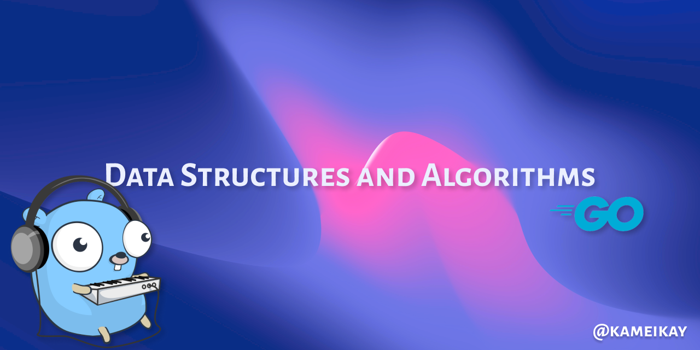

# Data Structures and Algorithms in Go 🚀

Welcome to the **Data Structures and Algorithms in Go** repository! If you're passionate about mastering the core concepts of data structures and algorithms using the Go programming language, you're in the right place. This repository serves as your go-to resource for understanding fundamental algorithms and implementing essential data structures efficiently.

## Table of Contents 📖

- [Introduction](#introduction)
- [Why Go?](#why-go)
- [What's Inside?](#whats-inside)
- [How to Use This Repository](#how-to-use-this-repository)
- [Contributing](#contributing)
- [Resources](#resources)
- [License](#license)

## Introduction 🌟

Welcome to a thrilling journey through the world of data structures and algorithms! This repository is designed to provide you with comprehensive explanations and hands-on projects to help you grasp these vital concepts. I'm using this repository to study in parallel and keep my programming bases fresh!

## Why Go? 🧩

Go (or Golang) is a fantastic choice for studying data structures and algorithms due to its simplicity, efficiency, and strong standard library. Its intuitive syntax makes learning algorithms a breeze, allowing you to focus on the core principles without getting bogged down in complex language features.

## What's Inside? 📦

- **Clear Explanations:** Each data structure and algorithm is accompanied by clear explanations of its underlying concepts. I break down complex ideas into digestible chunks.

- **Challenges:** Put your skills to the test with coding challenges designed to reinforce your understanding. Solutions are provided, but I encourage you to attempt them on your own first!

- **Project Showcases:** Apply your knowledge to exciting projects that showcase the real-world applications of the concepts you've learned.

## How to Use This Repository 🛠️

1. **Explore the Content:** Browse through the folders to find the specific data structures and algorithms you're interested in.

2. **Learn and Experiment:** Read the explanations and study the code examples. Feel free to modify and experiment with the code to deepen your understanding.

3. **Take on Challenges:** Challenge yourself with coding exercises. Compare your solutions to the provided ones to gain insights and improve your skills.

4. **Contribute:** Found a bug? Want to add an algorithm? Contributions are welcome! Check out the [Contributing](#contributing) section to learn how you can get involved.

## Resources 📚

Looking for additional resources to deepen your knowledge? Check out our recommended reading list, online courses, and other helpful materials in the [Resources](resources.md) section.

## License 📜

This repository is licensed under the [MIT License](LICENSE), which means you're free to use, modify, and distribute the content as long as you provide proper attribution.

---

Let's embark on a journey of discovery and mastery together. Happy coding and learning!